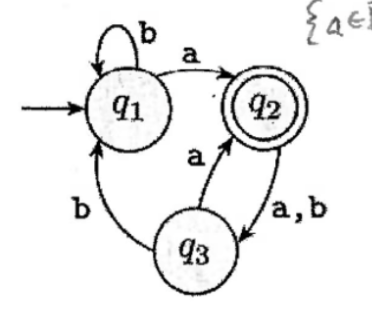
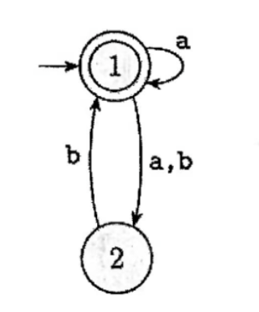
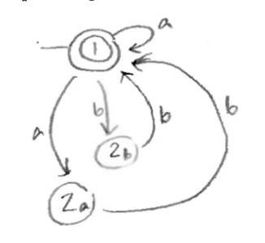
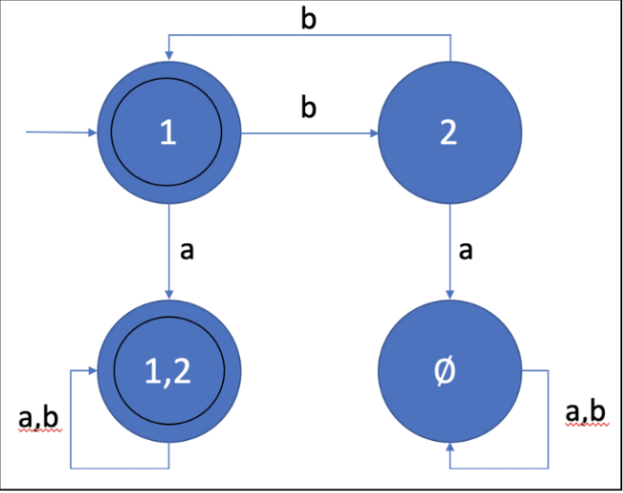

# Quiz 2 Review
[answer key](#key)

## Part 1
[part 1 key](#part-1-key)

> Answer the following True / False questions

A finite language is always recognizable by a $DFA$ [^1]

$DFAs$ and $NFAs$ recognize the exact same set of languages

A $DFA$ accepts if it ever enters an accept state

An $NFA$ only accepts if all branches reach an accept state

An $NFA$ can be in an infinite number of states at once

Regular languages are closed under complement (i.e., the set of all strings NOT in the original language)

All $NFAs$ can be converted into a _regular expression_ that describles the same language

$0^n1^n$ is not a valid _regular expression_

## Part 2

Give a regualr expression for (or describle in words) the language that this $DFA$ recognizes

Convert the following $NFA$ into an equivalent $DFA$ using the construction we saw in class. Specifically, the $DFA$ should have states representing subsets of states in the $NFA$ wiht appropriate transitions.

## Part 3
[part 3 key](#p3rt-3-key)

> These questions are about using the pumping lemma to prove that the language $A = {0^i1^j2^k|i + j = k}$ is no ta _regualr language_

First, list a string that cannot be pumped (just list it, you will get credit even if you do not know why it cannot be pumped)

Now, describe precisely why the string cannot be pumped. Makesure to include all possible cases if applicable

## Key 
### Part 1 Key
- True
- True
- False
- False
- False
- True
- True
- True

[^1]: test

### Part 2 Key

### Part 3 Key

1. $0^{p}1^{p}2^{2p}$
2. Pumping lemma states that the pumpable string must be within first p characters. This means all 0's are pumped which makes $i + j \neq k$
   >We will accept a proof that uses answer of the form 00112222 (Not in terms of p) if the logic is otherwise sound. However, a student who did not answer the previous question in terms of p will need to show many more cases in this question as they cannot rely on the third constraint of the pumping lemma
